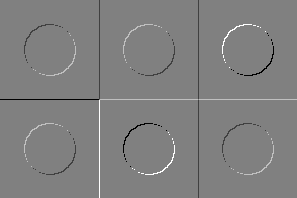
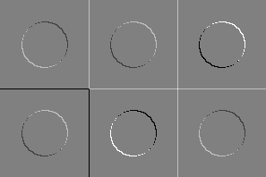
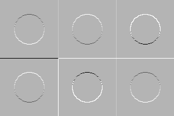
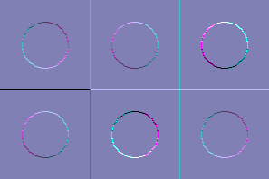

# ЛР5 - фильтрация

## Описание
Консольное приложение, генерирующее тестовое изображение - круги на фоне квадратов в 6 комбинациях уровней серого: *[0, 127, 255]*. Каждый квадрат имеет сторону 99 пикселей, каждый круг расположен в центре квадрата и имеет радиус 25 пикселей.
Необходимо получить три итоговых изображения в оттенках серого и поместить их на три канала итогового изображения.

## Результат работы приложения
Изображение $l_{1}$ для ядра
$$
\left(\begin{array}{cc} 
1 & 0\\
0 & -1
\end{array}\right)
$$ 

Изображение $l_{2}$ для ядра:
$$
\left(\begin{array}{cc} 
0 & 1\\
-1 & 0
\end{array}\right)
$$ 

Изображение $l_{3}$, где $l_{3}$ = $\sqrt{l_{1}*l_{1} + l_{2} * l_{2}}$:

Результирующее изображение, где каналами являются $l_{1}$, $l_{2}$ и $l_{3}$:
